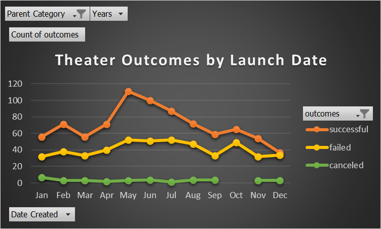
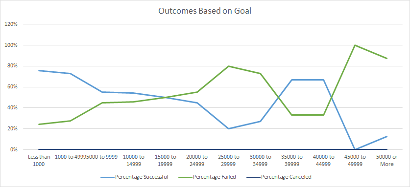

# Theater Kickstarter Outcomes 

## Overview of Project

### Purpose
-Analize a set of kickstarter data in order to visualize campaign outcomes based on launch dates and funding goals. 

## Analysis and Challenges

### Challenges and Difficulties Encountered
- The main challenges was removing excess data from the set that did not pertain to theater outcomes. There were many outliers from other forms of media that skewd data and made analysis more difficulty. In addition the outliers interfered with conditional formating in such a way that that percentiles limits had to be set in order to visualize outcomes. 
## Results

- What are two conclusions you can draw about the Outcomes based on Launch Date?

- What can you conclude about the Outcomes based on Goals?

- What are some limitations of this dataset?

- What are some other possible tables and/or graphs that we could create?
