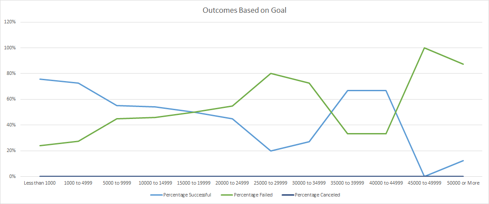

# Theater Kickstarter Outcomes 

## Overview of Project

### Purpose
-Analize a set of kickstarter data in order to visualize campaign outcomes based on launch dates and funding goals. 

## Analysis and Challenges

### Challenges and Difficulties Encountered
- The main challenges was removing excess data from the set that did not pertain to theater outcomes. There were many outliers from other forms of media that skewd data and made analysis more difficulty. In addition the outliers interfered with conditional formating in such a way that that percentiles limits had to be set in order to visualize outcomes. 
## Results

  When we observe the table titled Theater Outcomes based on Launch Date we can clearly see that May is the month in which most successful kickstarter campagins launch. Another thing seen here is that both October and December are bad months to launch a campagin. In these months we see, not only a peak in failed campagins, but also an almost equal amount of failed and successful campagins.  

- What can you conclude about the Outcomes based on Goals?

- What are some limitations of this dataset?

- What are some other possible tables and/or graphs that we could create?
